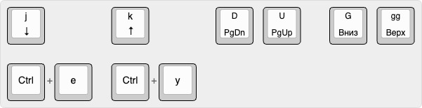

# 1. Перемещение по странице

## Вертикальная прокрутка

| Команда | Альтернатива* | Действие |
|---------|--------------|----------|
| `j` | `Ctrl + e` | Прокрутить вниз |
| `k` | `Ctrl + y` | Прокрутить вверх |
| `d` | — | Прокрутить вниз на полстраницы |
| `u` | — | Прокрутить вверх на полстраницы |
| `G` | — | Перейти в конец страницы |
| `gg` | — | Перейти в начало страницы |

> Альтернативные клавиши перемещения добавлены в Vimium для сохранения поведения редактора Vim.  
> В Vim `j` и `k` перемещают курсор, а `Ctrl + e` и `Ctrl + y` сдвигают экран, не меняя положение курсора.

## Горизонтальная прокрутка

| Команда | Значение |
|---------|----------|
| `h` | Прокрутить влево |
| `l` | Прокрутить вправо |
| `zH` | Переместиться в самый левый край страницы |
| `zL` | Переместиться в самый правый край страницы |

## Навигация между фреймами*

| Команда | Значение |
|---------|----------|
| `gf` | Перейти к следующему фрейму |
| `gF` | Перейти к основному (верхнему) фрейму страницы |

> **\*Фрейм (Frame)** — отдельная встроенная область страницы (например, встроенная карта, видео, документ).

---

## Почему бы не изменить `hjkl` на `jkl;` 

Возможно, изменить клавиши навигации кажется хорошей идеей, поскольку `jkl;` лучше соответствует привычному положению рук при слепой десятипальцевой печати. Однако `hjkl` — это не просто горячие клавиши Vimium, а часть общей логики Vim, которая используется и в других программах. Сохраняя стандартное расположение клавиш, мы приобретаем навык, который переносится между разными инструментами.

Примеры программ с Vim-подобным управлением:

- **Vim / Neovim** — текстовые редакторы;
- **less** — просмотрщик текста в терминале;
- **ranger / lf** — файловые менеджеры в терминале;
- **tmux** — управление терминальными сессиями;
- **qutebrowser** — браузер с Vim-подобным управлением.