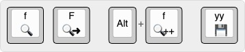
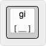
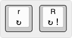
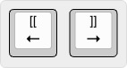

# 2. Работа на странице

## Открытие ссылок

| Команда | Значение |
|---------|----------|
| `f` | Открыть ссылку в текущей вкладке |
| `F` | Открыть ссылку в новой вкладке |
| `Alt + f` | Открыть несколько ссылок в новых вкладках |
| `yf` | Скопировать адрес ссылки |

## Выделение полей ввода

| `gi` | Перейти к первому полю ввода на странице |

## Перезагрузка страницы

| Команда | Значение |
|---------|----------|
| `r` | Обновить страницу |
| `R` | Жёсткое обновление (*Hard Reload*) — игнорировать кэш браузера |

## Переход между страницами

Работает на сайтах, где есть ссылки **Previous / Next**, «<» / «>».

| Команда | Значение |
|---------|----------|
| `[[` | Перейти на предыдущую страницу |
| `]]` | Перейти на следующую страницу |