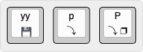
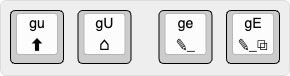

# 3. Работа с адресом страницы (URL)

## Копирование и открытие URL

| Команда | Действие |
|---------|----------|
| `yy` | Скопировать URL текущей страницы в буфер |
| `p` | Открыть URL из буфера в текущей вкладке |
| `P` | Открыть URL из буфера в новой вкладке |

> y — yank (скопировать);\
> p – put (вставить).

## Изменение текущего URL

| Команда | Действие |
|---------|----------|
| `gu` | Перейти на уровень выше в URL |
| `gU` | Перейти в корень сайта |
| `ge` | Изменить текущий URL |
| `gE` | Изменить текущий URL и открыть его в новой вкладке |
