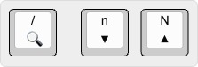

# 4. Поиск и выделение текста на странице

## Поиск текста

| Команда | Действие |
|---------|----------|
| `/` | Начать поиск на странице |
| `n` | Перейти к следующему совпадению (вперед) |
| `N` | Перейти к предыдущему совпадению (назад) |

Нажимаем `/` → вводим поисковый запрос → нажимаем <kbd>Enter</kbd>. Все совпадения будут подсвечены на странице.

**Примеры использования:**
* `/текст` → <kbd>Enter</kbd> → `n` → `n` → `n` (перемещение вперед по совпадениям)
* `/текст` → <kbd>Enter</kbd> → `N` → `N` → `N` (перемещение назад по совпадениям)

**Особенности работы поиска:**
* **Поиск фраз:** в поисковом запросе можно использовать пробелы для поиска словосочетаний целиком.
* **Умный регистр (Smartcase):** 
  * Если в запросе только строчные (маленькие) буквы — поиск регистронезависимый (найдет *текст*, *Текст*, *ТЕКСТ*).
  * Если есть хотя бы одна прописная (заглавная) буква — поиск становится регистрозависимым (ищет точное совпадение).
* **История запросов:** если после нажатия `/` нажимать <kbd>Стрелку вверх</kbd> или <kbd>Стрелку вниз</kbd>, можно перемещаться по истории прошлых поисковых запросов.

## Перемещение курсора (Caret mode)

Для перемещения курсора к тексту, который необходимо выделить, используется режим каретки (`Caret mode`).

| Команда | Действие |
|---------|----------|
| `vc` | Переход в Caret mode (активация перемещаемого курсора) |

### Навигация по тексту в режиме каретки

| Команда | Действие |
|---------|----------|
| `h` / `l` | Переместить курсор на один символ влево / вправо |
| `j` / `k` | Переместить курсор на одну строку вниз / вверх |
| `w` / `b` | Переместить курсор на одно слово вперед / назад |
| `e` | Переместить курсор к концу текущего слова |
| `0` | Переместить курсор в начало текущей строки |

## Выделение текста (Visual mode)

| Команда | Действие |
|---------|----------|
| `v` | Включить режим выделения (Visual mode) от текущей позиции |
| `V` (Shift + v) | Мгновенно выделить всю строку, на которой стоит курсор |

### Выделение текста в визуальном режиме

| Команда | Действие |
|---------|----------|
| `h` / `l` | Расширить или сузить выделение на один символ влево / вправо |
| `j` / `k` | Расширить выделение на одну строку вниз / вверх |
| `w` / `b` | Расширить или сузить выделение на одно слово вперед / назад |
| `e` | Расширить выделение до конца текущего слова |
| `0` | Расширить выделение до начала текущей строки |
| `$` | Расширить выделение до конца текущей строки |
